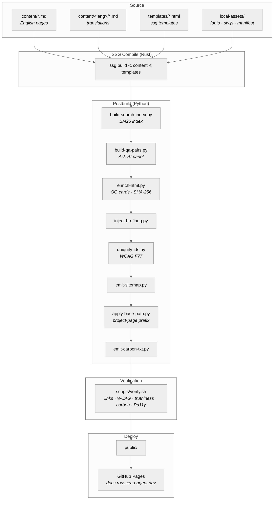

<!-- SPDX-License-Identifier: MIT -->

<p align="center">
  
</p>

<h1 align="center">rousseau-agent.github.io</h1>

<p align="center">
  Source for <a href="https://docs.rousseau-agent.dev">docs.rousseau-agent.dev</a> — the
  operator handbook for <a href="https://github.com/sebastienrousseau/rousseau-agent">rousseau-agent</a>.
  Rust SSG core, Python postbuild passes, Node-based accessibility audit,
  deployed to GitHub Pages behind a custom domain.
</p>

<p align="center">
  <a href="https://github.com/sebastienrousseau/rousseau-agent.github.io/actions"></a>
  <a href="https://github.com/sebastienrousseau/rousseau-agent.github.io/blob/main/LICENSE"></a>
  <a href="https://docs.rousseau-agent.dev"></a>
</p>

---

## Contents

**Getting started**

- [Install](#install) — toolchain prerequisites
- [Quick Start](#quick-start) — clone, build, serve
- [Layout](#layout) — repository folder map

**Pipeline**

- [Pipeline overview](#pipeline-overview) — source → compile → postbuild → verify → deploy
- [Build stages](#build-stages) — the ssg render + Python postbuild passes
- [Verification monitors](#verification-monitors) — what gates the build
- [Internationalisation](#internationalisation) — locale content + hreflang injection

**Operational**

- [Development](#development) — local build + serve loop
- [CI gates](#ci-gates) — what blocks a merge
- [Deployment](#deployment) — GitHub Pages + custom domain
- [Reuse](#reuse) — adapting the pipeline for your own docs site
- [License](#license)

---

## Install

| Tool | Version | Purpose |
| :--- | :--- | :--- |
| Rust | stable | Runs the `ssg` static-site compiler |
| `ssg` | 0.0.47 | Rust SSG binary (`cargo install ssg`) |
| Python | 3.12+ | Runs the postbuild passes + verification monitors |
| Node.js | 24 | Runs Pa11y (Chromium bundled) for the WCAG browser audit |
| ffmpeg | any recent | Encodes the demo WebM + captions |
| bash | 5.x | Drives `scripts/build.sh` and `scripts/verify.sh` |

## Quick Start

```bash
git clone https://github.com/sebastienrousseau/rousseau-agent.github.io.git
cd rousseau-agent.github.io

cargo install --locked ssg --version 0.0.47   # one-time SSG install
bash scripts/build.sh                          # emits public/

# Serve public/ under the project-page subpath so relative URLs resolve.
mkdir -p _serve && ln -sfn "$PWD/public" _serve/rousseau-agent.github.io
(cd _serve && python3 -m http.server 8000)
# → http://127.0.0.1:8000/rousseau-agent.github.io/
```

Ensure your commit-signing key is active before pushing.

<details>
<summary>Optional: run the full verification suite locally</summary>

```bash
# In a second shell, with the server above still running:
export BASE_URL=http://127.0.0.1:8000
export BASE_PATH=/rousseau-agent.github.io
bash scripts/verify.sh
```

`verify.sh` runs the same five monitors CI runs — broken-link check,
WCAG 2.2 static audit, HTML content-truthiness, page-weight carbon
budget, and a Pa11y WCAG 2.2 AA browser sweep.

</details>

## Layout

| Path | Contents |
| :--- | :--- |
| `content/` | Source markdown per page + locale subdirs (`de/`, `es/`, `fr/`, `ja/`, `pt-BR/`, `zh-Hans/`) |
| `content.schema.toml` | Front-matter schema (title, description, category, order) |
| `templates/` | ssg HTML/JS templates — English + 19 locale-chrome variants |
| `local-assets/` | Fonts, service worker, PWA manifest, video sources |
| `scripts/` | Build + verification pipeline (bash + Python) |
| `a11y-tooling/` | Pa11y wrapper + npm-only Chromium bundle |
| `.github/workflows/` | `deploy.yml` (Pages build + verify + deploy) |
| `public/` | Build output (gitignored; deployed as a Pages artifact) |

## Pipeline overview

`scripts/build.sh` is the one entry point. It runs `ssg` to render
markdown → HTML, then a chain of Python passes decorate, verify, and
harden every page before CI hands it to GitHub Pages.



## Build stages

`scripts/build.sh` performs the render, then walks each page through
~12 postbuild passes.

1. **Render** — `ssg build -c content -o public -t templates`.
2. **Strip livereload** — remove ssg's dev-only reload script tags.
3. **CSP fix** — ssg strips `unsafe-inline` from CSP directives; the
   post-pass restores them where the templates need inline scripts /
   styles.
4. **Highlight alias** — rename the hashed `highlight.<hash>.css` to
   the stable filename referenced by templates.
5. **Copy fonts** — mirror `local-assets/fonts/` into `public/fonts/`.
6. **Install service worker + manifest** — PWA assets.
7. **Search index** — `build-search-index.py` emits a BM25 corpus for
   client-side search.
8. **Q&A index** — `build-qa-pairs.py` powers the Ask-AI panel.
9. **HTML enrichment** — `enrich-html.py` writes OG cards and a
   SHA-256 provenance hash per page.
10. **Hreflang injection** — `inject-hreflang.py` (ssg does not emit
    hreflang alternates).
11. **WCAG passes** — strip deprecated `align=` (H49); uniquify
    duplicate `id=` attributes (F77).
12. **Sitemap + video + base-path + carbon.txt** — the four
    finishing passes.

## Verification monitors

`scripts/verify.sh` runs five gates against a running HTTP server
that mounts `public/` under the same subpath GitHub Pages will serve.
Any failure blocks a merge.

| Monitor | Script | Gate |
| :--- | :--- | :--- |
| Broken internal links | `check-links.py` | HTTP 200 on every internal href |
| WCAG 2.2 static audit | `wcag-static-audit.py` | Pa11y-equivalent regex sweep |
| Content truthiness | `verify-content.py` | HTML text matches source markdown |
| Carbon budget | `check-perf-budget.py` | Per-page weight under budget |
| Pa11y WCAG 2.2 AA | `pa11y-audit.sh` | Sampled Chromium audit |

## Internationalisation

Content lives per locale under `content/<lang>/`. Currently active
translations: **de, es, fr, ja, pt-BR, zh-Hans** (plus the English
canonical). Locale chrome (nav, footer, dates) lives in
`templates/<lang>/` for 19 languages — those without content pages
still render a translated chrome shell for future rollout.

`inject-hreflang.py` walks the built tree and writes an hreflang
block into every rendered page so search engines can pair each URL
with its locale variants.

## Development

```bash
bash scripts/build.sh                            # full render + postbuild
(cd public && python3 -m http.server 8000)       # bare serve (no subpath)

# The CI-shaped serve (matches production URL structure):
mkdir -p _serve && ln -sfn "$PWD/public" _serve/rousseau-agent.github.io
(cd _serve && python3 -m http.server 8000)

# Verification (against the CI-shaped serve above):
export BASE_URL=http://127.0.0.1:8000
export BASE_PATH=/rousseau-agent.github.io
bash scripts/verify.sh
```

Iterate: edit `content/<page>.md` or `templates/<slug>.html`, re-run
`scripts/build.sh`, refresh the browser.

## CI gates

`.github/workflows/deploy.yml` runs on every push to `main`:

1. **Install ssg** — pinned to 0.0.47 via cargo (cached).
2. **Verify ffmpeg** — required by `build-video-assets.sh`.
3. **Build** — `bash scripts/build.sh` with `BASE_PATH=/rousseau-agent.github.io`.
4. **Serve** — mount `public/` under the subpath on a local port.
5. **Verify** — run `bash scripts/verify.sh` (all five monitors above).
6. **Upload + deploy** — Pages artifact → `actions/deploy-pages@v4`.

If any monitor fails, the deploy step never runs.

## Deployment

Deployed to GitHub Pages under the custom domain
[`docs.rousseau-agent.dev`](https://docs.rousseau-agent.dev). The
CNAME is enforced via `public/CNAME` (emitted by the build) and the
Pages settings on the repo. HTTPS is provided by GitHub Pages' Let's
Encrypt integration.

## Reuse

The pipeline is straightforward to fork for another docs site:

1. Replace `content/` with your markdown pages.
2. Rebrand `templates/` (`en/`, `feature.html`, `page.html`, `post.html`).
3. Update `content.schema.toml` category enum.
4. Adjust the `BASE_PATH` environment default in `.github/workflows/deploy.yml`.
5. Point your custom domain via `public/CNAME` and Pages settings.

The postbuild passes are generic — search index, hreflang, WCAG
uniquify-id, carbon.txt — and work unchanged on any ssg-rendered
tree.

## License

Documentation and site source are released under the
[MIT License](LICENSE). The rendered content mirrors the licensing
of the [rousseau-agent](https://github.com/sebastienrousseau/rousseau-agent)
project it documents.

<p align="right"><a href="#contents">Back to Top</a></p>
